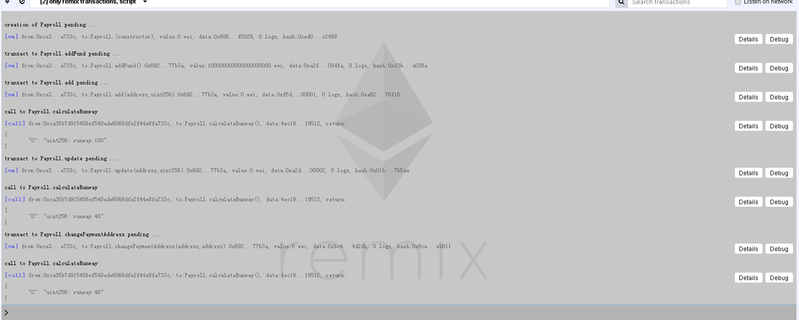
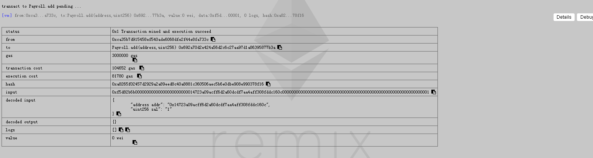
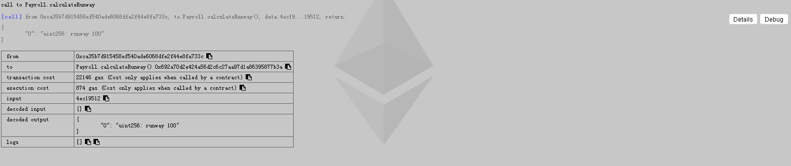
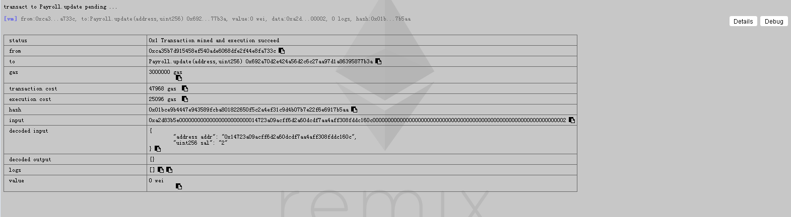
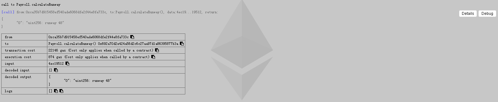
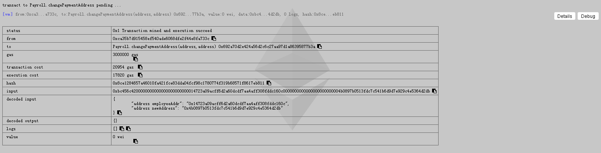
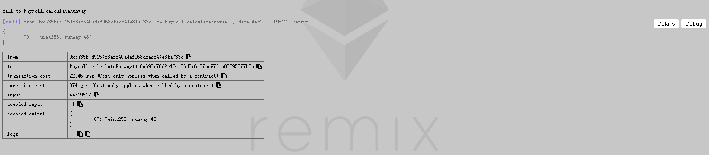

## 硅谷live以太坊智能合约 第三课作业
这里是同学提交作业的目录

### 第三课：课后作业
- 第一题：完成今天所开发的合约产品化内容，使用Remix调用每一个函数，提交函数调用截图
- 第二题：增加 changePaymentAddress 函数，更改员工的薪水支付地址，思考一下能否使用modifier整合某个功能
- 第三题（加分题）：自学C3 Linearization, 求以下 contract Z 的继承线
- contract O
- contract A is O
- contract B is O
- contract C is O
- contract K1 is A, B
- contract K2 is A, C
- contract Z is K1, K2

### 作业完成报告

#### 完成产品化内容并增加 function changePaymentAddress  

测试调用预览  
  

增加员工  
  

增加后检查  
  

更新员工工资  
  

更新后检查  
  

改变员工地址  
  

改变地址后检查  
  

#### 附加题：计算 contract Z 继承线

```
L[O] := [O]

L[A] := [A] + merge(L[O], [O])
      = [A] + merge([O], [O])
      = [A, O]
L[B] := [B, O]
L[C] := [C, O]

L[K1] := [K1] + merge(L[A], L[B], [A, B])
       = [K1] + merge([A, O], [B, O], [A, B])
       = [K1, A] + merge([O], [B, O], [B])
       = [K1, A, B] + merge([O], [O])
       = [K1, A, B, O]
L[K2] := [K2] + merge(L[A], L[C], [A, C])
       = [K2] + merge([A, O], [C, O], [A, C])
       = [K2, A] + merge([O], [C, O], [C])
       = [K2, A, C] + merge([O], [O])
       = [K2, A, C, O]

L[Z] := [Z] + merge(L[K1], L[K2], [K1, K2])
      = [Z] + merge([K1, A, B, O], [K2, A, C, O], [K1, K2])
      = [Z, K1] + merge([A, B, O], [K2, A, C, O], [K2])
      = [Z, K1, K2] + merge([A, B, O], [A, C, O])
      = [Z, K1, K2, A] + merge([B, O], [C, O])
      = [Z, K1, K2, A, B] + merge([O], [C, O])
      = [Z, K1, K2, A, B, C] + merge([O], [O])
      = [Z, K1, K2, A, B, C, O]
```

参考  
> https://en.wikipedia.org/wiki/C3_linearization  
> https://www.youtube.com/watch?v=YLgf8wGCX2w  
> http://kaiyuan.me/2016/04/27/C3_linearization/  
> https://mozillazg.com/2016/11/python-mro-compute.html